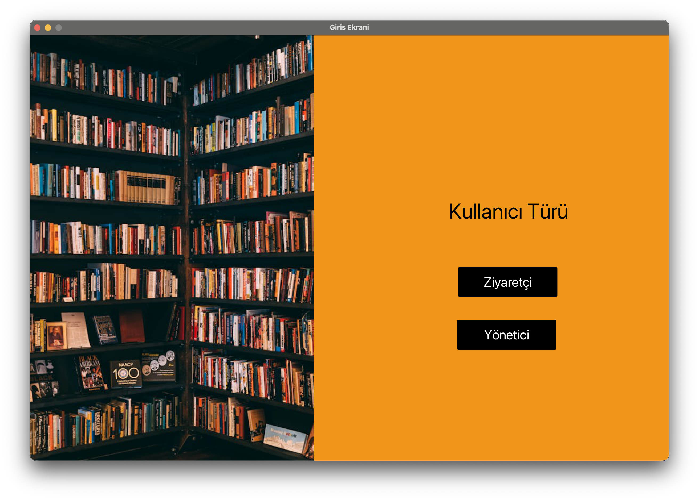
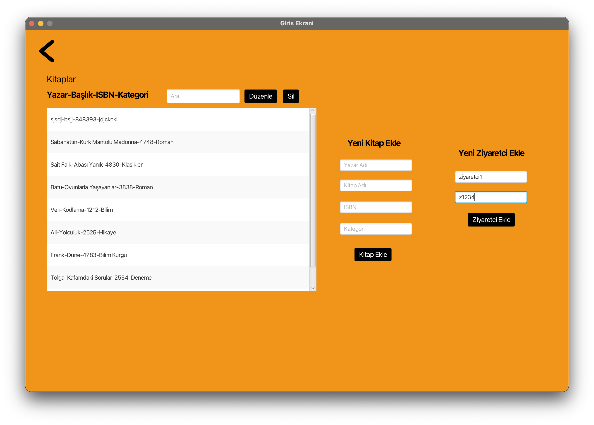
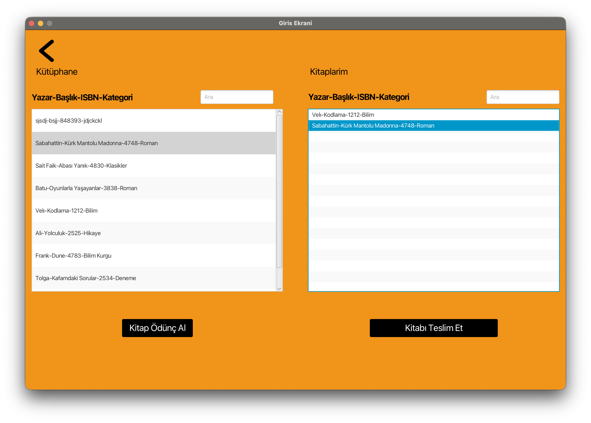

# 📚 Library Management System

A modern and user-friendly **Library Management System** application. Designed as a desktop application developed with JavaFX.


## 🎯 About The Project

This project is a comprehensive desktop application developed to manage library operations digitally. Designed using Object-Oriented Programming (OOP) principles, it supports two different user roles: administrator and visitor.

## ✨ Features

### 👨‍💼 Admin Panel
- 📖 Add, edit, and delete books
- 🔍 Search books (by author, book name, category, ISBN)
- 👥 Create new visitor accounts
- 📋 List all books

### 👤 Visitor Panel
- 🔍 Search and list books
- 📥 Borrow books
- 📤 Return books
- 📚 View borrowed books

## 🏗️ Technical Infrastructure

- **Programming Language:** Java 21
- **GUI Framework:** JavaFX 21
- **Build Tool:** Maven
- **Architecture:** MVC (Model-View-Controller)
- **Data Storage:** File-based (txt format)

## 📁 Project Structure

```
src/main/java/com/example/demo11/
├── Javafx.java              # Main application class
├── Kullanici.java           # Abstract user class
├── Yonetici.java            # Admin class
├── Ziyaretci.java           # Visitor class
├── KullaniciYonetimi.java   # User management operations
├── Kitap.java               # Book model class
├── KutuphaneSistemi.java    # Library system management
├── YoneticiEkran.java       # Admin screen controller
├── ZiyaretciEkran.java      # Visitor screen controller
├── EditBook.java            # Book editing dialog
└── KitapZatenOduncException.java  # Custom exception class
```

## 🚀 Installation and Running

### Requirements
- Java JDK 21 or higher
- Maven 3.6+

### Steps

1. Clone the project:
```bash
git clone https://github.com/gedik25/Library-Management-System.git
cd Library-Management-System
```

2. Compile with Maven:
```bash
mvn clean compile
```

3. Run the application:
```bash
mvn javafx:run
```

## 🔐 Default Login Credentials

### Admin Accounts
| Username | Password |
|----------|----------|
| Ali      | 12345    |
| Tolga    | 54321    |

## 📸 Screenshots

### Login Screen / Giriş Ekranı


### Admin Panel / Yönetici Paneli


### Visitor Panel / Ziyaretçi Paneli


## 🎓 OOP Concepts

Object-oriented programming concepts used in this project:

- **Inheritance:** `Yonetici` and `Ziyaretci` classes are derived from the `Kullanici` abstract class
- **Encapsulation:** Private variables and getter/setter methods
- **Abstraction:** Abstract `Kullanici` class
- **Exception Handling:** Custom `KitapZatenOduncException` exception class

## 👨‍💻 Developers

| Developer | Role |
|-----------|------|
| **Muhammet Ali Gedik** | Project Owner & Developer |
| **Tolga Ertegi** | Developer |

## 📝 License

This project was developed for educational purposes.

---

# 📚 Kütüphane Yönetim Sistemi

Modern ve kullanıcı dostu bir **Kütüphane Yönetim Sistemi** uygulaması. JavaFX ile geliştirilmiş masaüstü uygulaması olarak tasarlanmıştır.

## 🎯 Proje Hakkında

Bu proje, kütüphane işlemlerini dijital ortamda yönetmek için geliştirilmiş kapsamlı bir masaüstü uygulamasıdır. Nesne yönelimli programlama (OOP) prensipleri kullanılarak tasarlanmış olup, yönetici ve ziyaretçi olmak üzere iki farklı kullanıcı rolü desteklemektedir.

## ✨ Özellikler

### 👨‍💼 Yönetici Paneli
- 📖 Kitap ekleme, düzenleme ve silme
- 🔍 Kitap arama (yazar, kitap adı, kategori, ISBN)
- 👥 Yeni ziyaretçi hesabı oluşturma
- 📋 Tüm kitapları listeleme

### 👤 Ziyaretçi Paneli
- 🔍 Kitap arama ve listeleme
- 📥 Kitap ödünç alma
- 📤 Kitap teslim etme
- 📚 Ödünç alınan kitapları görüntüleme

## 🏗️ Teknik Altyapı

- **Programlama Dili:** Java 21
- **GUI Framework:** JavaFX 21
- **Build Tool:** Maven
- **Mimari:** MVC (Model-View-Controller)
- **Veri Saklama:** Dosya tabanlı (txt formatı)

## 📁 Proje Yapısı

```
src/main/java/com/example/demo11/
├── Javafx.java              # Ana uygulama sınıfı
├── Kullanici.java           # Abstract kullanıcı sınıfı
├── Yonetici.java            # Yönetici sınıfı
├── Ziyaretci.java           # Ziyaretçi sınıfı
├── KullaniciYonetimi.java   # Kullanıcı yönetim işlemleri
├── Kitap.java               # Kitap model sınıfı
├── KutuphaneSistemi.java    # Kütüphane sistem yönetimi
├── YoneticiEkran.java       # Yönetici ekranı controller
├── ZiyaretciEkran.java      # Ziyaretçi ekranı controller
├── EditBook.java            # Kitap düzenleme dialog
└── KitapZatenOduncException.java  # Özel exception sınıfı
```

## 🚀 Kurulum ve Çalıştırma

### Gereksinimler
- Java JDK 21 veya üzeri
- Maven 3.6+

### Adımlar

1. Projeyi klonlayın:
```bash
git clone https://github.com/gedik25/Library-Management-System.git
cd Library-Management-System
```

2. Maven ile derleyin:
```bash
mvn clean compile
```

3. Uygulamayı çalıştırın:
```bash
mvn javafx:run
```

## 🔐 Varsayılan Giriş Bilgileri

### Yönetici Hesapları
| Kullanıcı Adı | Şifre |
|---------------|-------|
| Ali           | 12345 |
| Tolga         | 54321 |

## 📸 Ekran Görüntüleri

### Giriş Ekranı


### Yönetici Paneli


### Ziyaretçi Paneli


## 🎓 OOP Kavramları

Bu projede kullanılan nesne yönelimli programlama kavramları:

- **Kalıtım (Inheritance):** `Kullanici` abstract sınıfından `Yonetici` ve `Ziyaretci` sınıfları türetilmiştir
- **Kapsülleme (Encapsulation):** Private değişkenler ve getter/setter metodları
- **Soyutlama (Abstraction):** Abstract `Kullanici` sınıfı
- **Exception Handling:** Özel `KitapZatenOduncException` exception sınıfı

## 👨‍💻 Geliştiriciler

| Geliştirici | Rol |
|-------------|-----|
| **Muhammet Ali Gedik** | Proje Sahibi & Geliştirici |
| **Tolga Ertegi** | Geliştirici |

## 📝 Lisans

Bu proje eğitim amaçlı geliştirilmiştir.

---

⭐ If you liked this project, don't forget to give it a star! / Bu projeyi beğendiyseniz yıldız vermeyi unutmayın!
